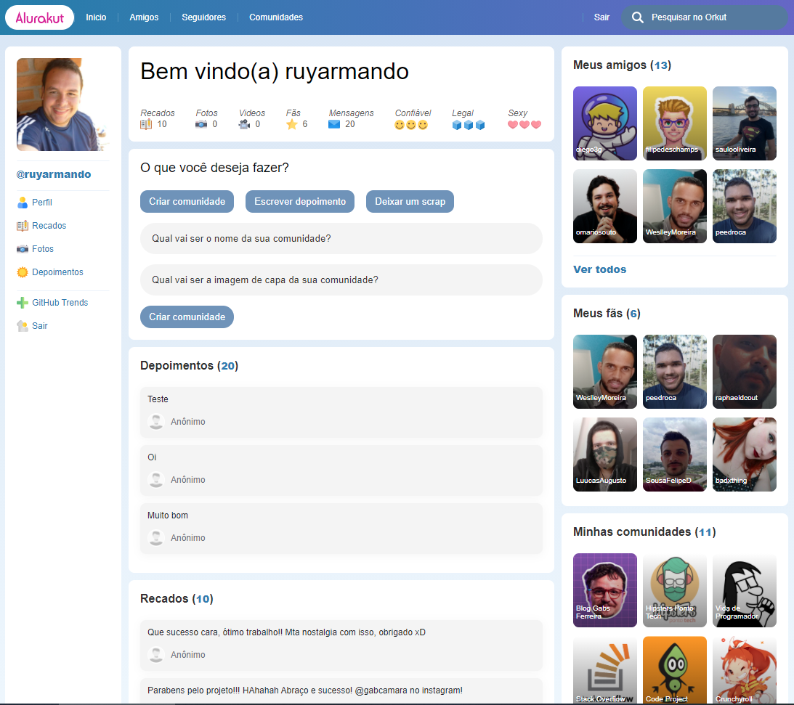

<p align="center">
  
</p>

<p align="center">
  
  
  
</p>

<h1 align="center">
    
</h1>

<br>

# Alurakut 1.0

<div align="center">
<a href="https://alurakut-ruyarmando.vercel.app" target="_blank" alt="demonstração do app">Demo/Vercel</a> 
<span> · </span>
<a href="https://www.figma.com/file/xHF0n0qxiE2rqjqAILiBUB/Alurakut">Figma</a> 
<span> · </span>
<a href="https://twitter.com/ruyarmando">Twitter</a>
</div>
<br />
<div align="center">
  <sub>Code by <a href="https://twitter.com/ruyarmando">Ruy Armando </a> ❤️👋</sub>
</div>
<br />

## 💻 Sobre o projeto

Nesta terceira edição do Imersão React, vamos reviver a web do passado criando nossa rede social baseada no famoso Orkut, que fez um tremendo sucesso, mas mas não vingou.

🌟 Recursos Adicionais:
- Visualizar todas as comunidades (página com a listagem)
- Visualizar todos os amigos (página com a listagem)
- Visualizar todos os seguidores (página com a listagem)
- Escrever recado (integrado com o Dato CMS)
- Escrever depoimento (integrado com o Dato CMS)
- Revisado a lib AlurakutCommons quanto as rotas e algumas melhorias no menu.

✨ Implementações Futuras:
- Página com perfil dos amigos/seguidores.
- Deixas recados e depoimentos para amigos/seguidores.
- Listagem de todas as comunidades criadas.
- Inscrição com membro da comunidade.
- Paginação dos dados da comunidades, amigos e seguidores.

## 🧪 Tecnologias

Este projeto foi desenvolvido utilizando:

🎯 Ferramentas:
- [VS Code](https://code.visualstudio.com)
- [Vercel](https://vercel.com)
- [React](https://reactjs.org)
- [Next.Js](https://nextjs.org)
- [Styled Components](https://styled-components.com)

## 🚀 Começando

### Requisitos

- Você precisa instalar [Node.js](https://nodejs.org/en/download/) e [Yarn](https://yarnpkg.com/) para executar este projeto.

**Clone o projeto e acesse a pasta:**

```bash
$ git clone https://github.com/RuyArmando/alurakut.git
$ cd alurakut
```

**Siga os passos abaixo:**
```bash
# Install the dependencies
$ yarn

# Start the project
$ yarn dev
```
O aplicativo estará disponível em `http://localhost:3000`

## 🎨 Layout

Você pode ver o layout do projeto através do [Figma](http://figma.com/):

- [Prototype by Alura](https://www.figma.com/file/xHF0n0qxiE2rqjqAILiBUB/Alurakut) 

## 📝 License

This project is licensed under the MIT License. See the [LICENSE](LICENSE) file for details.
